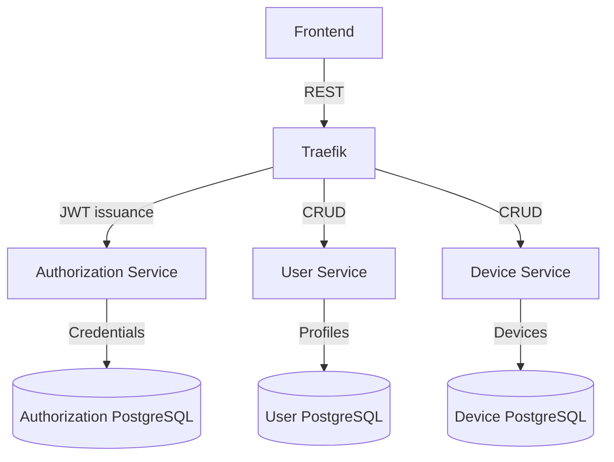

# System Architecture

The platform is organised as a suite of Spring Boot microservices that communicate over HTTP and are fronted by Traefik.

## Responsibilities

- **Authorization Service** – Issues JWT tokens after validating credentials stored in PostgreSQL.
- **Traefik** – Provides routing for `/api/auth`, `/api/users`, and `/api/devices`, stripping the `/api` prefix before forwarding the requests to the respective services.
- **User Service** – Provides CRUD APIs for platform users backed by PostgreSQL.
- **Device Service** – Provides CRUD APIs for devices and their metadata backed by PostgreSQL.

Each service is packaged as a Docker image and exposes a REST interface. Traefik is the only component exposed to the public network; the other services communicate inside the Docker network.

## Data storage

Every microservice owns its database schema. Docker Compose provisions three PostgreSQL instances—`authorization-db`, `user-db`, and `device-db`—so that data is persisted between restarts. Spring Boot initialises tables via JPA and seeds demo records through `data.sql` files.

## Security model

- JWT tokens carry the `username` and `roles` claims. The signing secret is configurable through the `AUTH_JWT_SECRET` environment variable.
- Traefik performs HTTP routing only. Services are responsible for enforcing authentication and authorization policies.
- All services use HTTP for simplicity; terminate TLS at Traefik (or an upstream load balancer) in production.

## Deployment diagram

The Docker Compose stack mirrors the expected deployment layout:

- `authorization`, `user`, and `device` services run as independent containers.
- `authorization-db`, `user-db`, and `device-db` provide persistent PostgreSQL storage for each service.
- `traefik` exposes port 8080 to the host and routes `/api/*` requests to the appropriate backend.
- The frontend communicates with Traefik exclusively and never talks to the services directly.

When deploying to production, replace the single-node PostgreSQL instances with managed clusters, configure secure credentials, and enable HTTPS termination on Traefik.
