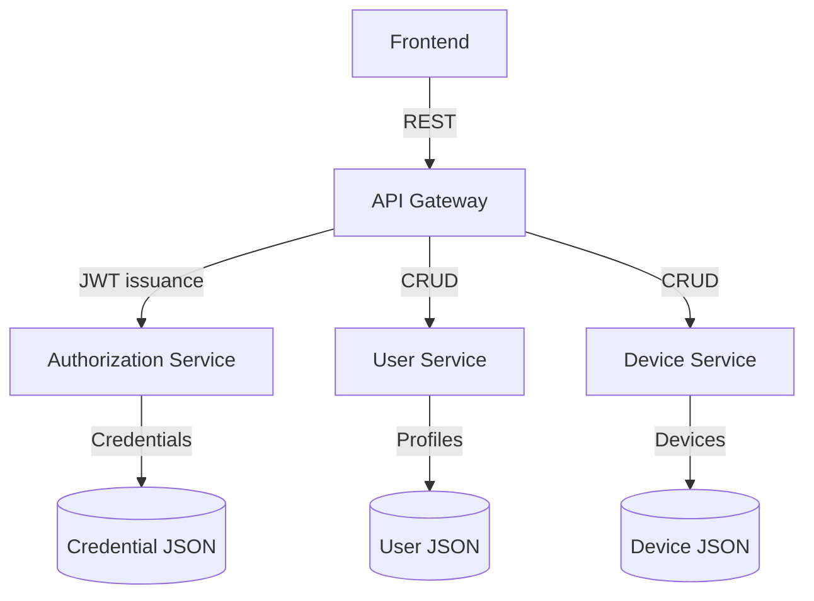

# System Architecture

The platform is organised as a suite of Spring Boot microservices that communicate over HTTP.

## Responsibilities

- **Authorization Service** – Issues JWT tokens after validating credentials stored in a JSON file.
- **API Gateway** – Lightweight orchestrator that forwards requests to the downstream services and surfaces a single entry point.
- **User Service** – Provides CRUD APIs for platform users.
- **Device Service** – Provides CRUD APIs for devices and their metadata.

Each service is packaged as a Docker image and exposes a REST interface. The gateway is the only component exposed to the public network; the other services communicate inside the Docker network.

## Data storage

Sample data lives in JSON files within each service (`src/main/resources/data`). These files are copied into the Docker images and seeded at startup to keep the example simple while still enabling meaningful API calls.

## Security model

- JWT tokens carry the `username` and `roles` claims. The signing secret is configurable through the `AUTH_JWT_SECRET` environment variable.
- The API Gateway simply proxies requests and relies on upstream services for authorization decisions. Production deployments should extend the gateway with token validation middleware or leverage a dedicated API gateway solution.
- All services use HTTP for simplicity; terminate TLS at an ingress proxy in production.

## Deployment diagram

The Docker Compose stack mirrors the expected deployment layout:

- `authorization`, `user`, and `device` services run as independent containers.
- `api-gateway` exposes port 8083 to the host and depends on the other services at startup.
- A frontend (not included) would communicate with `api-gateway` exclusively.

When deploying to production, place the gateway behind an HTTPS reverse proxy (NGINX, Traefik) and replace JSON storage with a persistent database.
